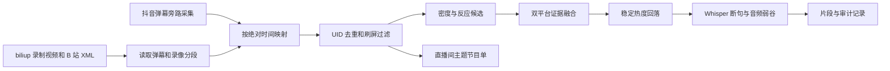

# Danmaku Highlight Pipeline

一个基于直播弹幕生成节目单、发现候选片段并辅助确定剪辑边界的参考实现。

> [!IMPORTANT]
> 这不是开箱即用的通用剪辑器。当前规则来自一个具体直播间的观众语言、常用表情和节目模式，未经重新标注和校准，直接用于其他主播会产生明显漏检和误检。

## 它负责什么

- 读取 B 站 XML 弹幕，按绝对时间映射同场抖音弹幕。
- 过滤缺失 UID 和短时间内的单用户刷屏。
- 用消息密度、独立用户数、笑声/反应词和历史基线发现候选事件。
- 生成节目单主题点，例如笑点、理财、猎人模式和 Boss/英雄模式。
- 结合稳定热度回落、语音断句和音频弱谷确定剪辑边界。
- 输出审计数据，解释每个候选点的来源、平台证据和边界依据。

## 它不负责什么

- 不录制直播，不登录或投稿 B 站。
- 不包含 cookie、token、直播间配置、历史弹幕、视频或模型文件。
- 不保证主题词在其他直播间具有相同含义。
- 不替代人工抽检，也不处理内容版权和平台合规问题。

我们在实际流水线中借用 [biliup](https://github.com/biliup/biliup) 完成直播录制和多 P 投稿。本仓库只公开录制完成后的算法层，与 biliup 没有代码包含关系，也不是 biliup 官方组件。

## 当前流程



算法的详细阶段见 [docs/architecture.md](docs/architecture.md)。需要迁移到其他直播间时，先阅读 [docs/customization.md](docs/customization.md) 和 [docs/limitations.md](docs/limitations.md)。

## 快速开始

要求：

- Python 3.9+
- FFmpeg 和 ffprobe
- 可选：`faster-whisper`，用于语音边界修正

```powershell
git clone <your-repository-url>
cd danmaku-highlight-pipeline
python -m venv .venv
.\.venv\Scripts\Activate.ps1
pip install -e ".[speech]"
python -m unittest discover -s tests -q
```

只生成节目单：

```powershell
danmaku-program .\backup\recording.xml --no-clipboard --no-pause
```

生成剪辑前先查看参数：

```powershell
danmaku-highlights --help
danmaku-audit --help
```

FFmpeg 不在 `PATH` 时，可以设置：

```powershell
$env:FFMPEG_BIN = 'C:\ffmpeg\bin\ffmpeg.exe'
$env:FFPROBE_BIN = 'C:\ffmpeg\bin\ffprobe.exe'
```

默认工作目录为当前目录，也可以通过 `DANMAKU_WORKSPACE_ROOT` 指定。建议目录布局：

```text
workspace/
  backup/        # 源 XML / ASS
  config/        # 本地配置，不提交凭据
  models/        # 可选 Whisper 模型
  records/       # 小型分析与审计记录
  outputs/       # 媒体输出和校验缓存
```

## 代码地图

| 文件 | 作用 |
|---|---|
| `program_rule_engine_v2.py` | 滑动窗口、笑声反应、候选评分 |
| `dual_platform_program.py` | 录像时钟、双平台映射、稳定区间和候选融合 |
| `program_source_analysis.py` | 原节目单主题识别和平台证据 |
| `program_extractor.py` | 节目单兼容层与命令行入口 |
| `highlight_editor.py` | 片段起止、语音边界、转场和渲染 |
| `program_audit.py` | 只读审计和规则解释 |
| `danmaku_uid.py` | UID 有效性与短窗刷屏过滤 |
| `media_integrity.py` | ffprobe 媒体完整性校验 |

## 开源边界

仓库中的默认关键词和阈值用于展示“目前如何实现”，不是通用推荐值。真实自动上传脚本、账号凭据、主播映射、BV 记录和生产目录没有进入仓库。

许可证：MIT。biliup、FFmpeg、faster-whisper 等外部项目使用各自许可证。
